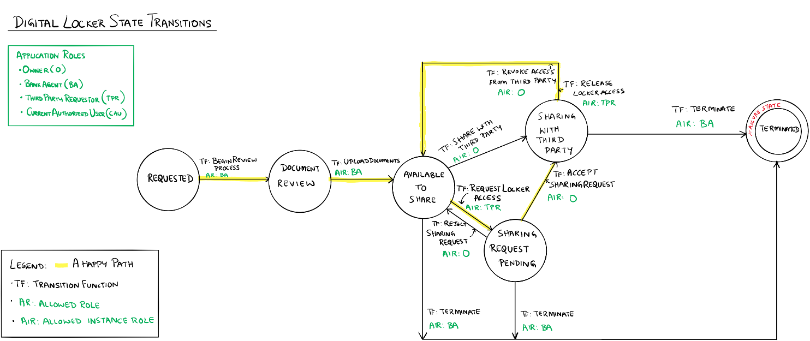

Digital Locker Sample Application for Azure Blockchain Marketplace
==================================================================

Overview 
---------

 

The Digital Locker application expresses a workflow of sharing digitally locked
files where the owner of the files controls the access to these files.  We
illustrate Digital Locker using an example of an owner performing access control
to their document held by a bank.  The state transition diagram below shows the
interactions among the states in this workflow. 

Application Roles 
------------------

| Name                   | Description                                       |
|------------------------|---------------------------------------------------|
| Owner                  | The owner of the digital asset.                   |
| BankAgent              | The keeper of the digital asset.                  |
| ThirdPartyRequestor    | A person requesting access to the digital asset.  |
| CurrentAuthorizedUser  | A person authorized to access the digital asset.  |

 

States 
-------

| Requested              | Indicates owner's request to make the digital asset available.                                             |
|------------------------|------------------------------------------------------------------------------------------------------------|
| DocumentReview         | Indicates that the bank agent has reviewed the owner's request.                                            |
| AvailableToShare       | Indicates that the bank agent has upload the digital asset and the digital asset is available for sharing  |
| SharingWithThirdParty  | Indicates that the owner is reviewing a third party's request to access the digital asset.                 |
| Terminated             | Indicates termination of sharing the digital asset.                                                        |

 Workflow Details
-----------------

 

 

 

An instance of the Digital Locker application's workflow starts in the Requested
state when an Owner requests their bank to begin a process of sharing a document
held by the bank.  A BankAgent causes the state to transition to DocumentReview
by calling the function BeginReviewProcess indicating that the process to review
the request has begun.  Once the review is complete, the BankAgent then makes
the document available by uploading the documents.  The AvailableToShare state
can be thought of a perpetual state, more on this in a bit. Once the document is
available to share, the document can be shared either with a third party that
the owner has identified or any random third party requestor.  If the owner
specifies the third party requestor, then the state transitions from
AvailableToShare to SharingWithThirdParty.  If a random third party requestor
needs access to the document, then that third party requestor first requests
access to the document.  At this point, the owner can either accept the request
and grant access or reject the request.  If the owner rejects the request to the
random third party requestor, then the state goes back to AvailableToShare.  If
the owner accepts the request to allow the random third party request to access
the document, then the state transitions to SharingWithThirdParty.  Once the
third party requestor is done with the document, they can release the lock to
the document and the state transitions to AvailableToShare.  The owner can also
cause the state to transition from SharingWithThirdParty to AvailableToShare
when they revoke access from the third party requestor.  Finally, at any time
during these transitions the bank agent can decide to terminate the sharing of
the document once the document becomes available to share. 

 

The happy path shown in the state transition diagram traces a path where the
owner grants access to a random third party. 

Application Files
-----------------
[DigitalLocker.json](./ethereum/DigitalLocker.json)

[DigitalLocker.sol](./ethereum/DigitalLocker.sol)
